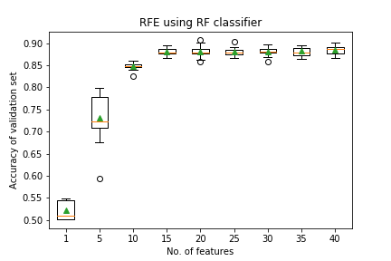
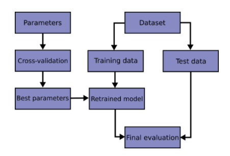
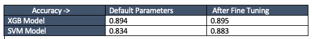

# Discover Exoplanet 

This project is to help NASA in discovering hidden planets outside of our solar system using the data collected from NASA Kepler space telescope over a period of nine years. To make it happen, we will create machine learning models capable of classifying candidate exoplanets from the raw dataset.

This project consists of an end-end machine learning pipeline:

1. [Preprocess the data](#Preprocessing)
1. [Select the features](#Feature-selection)
1. [Tune the models](#Tune-Model-Parameters)
1. [Compare the models](#Evaluate-Model-Performance)
1. [Save the models](#Save-for-deployment)

- - -
# Data
[Exoplanet Data Source](https://www.kaggle.com/nasa/kepler-exoplanet-search-results)

There are 40 features and 3 categories of exoplanet dispositions (in 'koi_disposition'). The categories are `CANDIDATE`, `CONFIRMED` and `FALSE POSITIVE`.

  - koi_disposition : The category of this KOI from the Exoplanet Archive. Current values are CANDIDATE, FALSE POSITIVE, or CONFIRMED. (THIS is the target value)

As per the [exoplanet archive](https://exoplanetarchive.ipac.caltech.edu/docs/API_kepcandidate_columns.html#pdisposition), the features are described as follows:

1. koi_fpflag_nt : Not Transit-Like Flag (A KOI whose light curve is not consistent with that of a transiting planet. This includes, but is not limited to, instrumental artifacts, non-eclipsing variable stars, and spurious (very low SNR) detections.) (Boolean)
1. koi_fpflag_ss : Stellar Eclipse Flag. A KOI that is observed to have a significant secondary event, transit shape, or out-of-eclipse variability, which indicates that the transit-like event is most likely caused by an eclipsing binary. However, self-luminous, hot Jupiters with a visible secondary eclipse will also have this flag set, but with a disposition of PC. (Boolean)
1. koi_fpflag_co : Centroid Offset Flag. The source of the signal is from a nearby star, as inferred by measuring the centroid location of the image both in and out of transit, or by the strength of the transit signal in the target's outer (halo) pixels as compared to the transit signal from the pixels in the optimal (or core) aperture. (Boolean)
1. koi_fpflag_ec : Ephemeris Match Indicates Contamination Flag. The KOI shares the same period and epoch as another object and is judged to be the result of flux contamination in the aperture or electronic crosstalk. (Boolean)
1. koi_period : Orbital Period (days). The interval between consecutive planetary transits. (float)
1. koi_period_err1: koi period positive error bar (float)
1. koi_period_err2: koi period negative error bar (float)
1. koi_time0bk: Transit Epoch (BJD - 2,454,833.0). The time corresponding to the center of the first detected transit in Barycentric Julian Day (BJD) minus a constant offset of 2,454,833.0 days. The offset corresponds to 12:00 on Jan 1, 2009 UTC. (float)
1. koi_time0bk_err1: koi time0bk positive error bar (float)
1. koi_time0bk_err2: koi time0bk negative error bar (float)
1. koi_impact: 	Impact Parameter. The sky-projected distance between the center of the stellar disc and the center of the planet disc at conjunction, normalized by the stellar radius. (float)
1. koi_impact_err1: koi impact positive error bar (float)
1. koi_impact_err2: koi impact negative error bar (float)
1. koi_duration: Transit Duration (hours). The duration of the observed transits. Duration is measured from first contact between the planet and star until last contact. Contact times are typically computed from a best-fit model produced by a Mandel-Agol (2002) model fit to a multi-quarter Kepler light curve, assuming a linear orbital ephemeris. (float)
1. koi_duration_err1: koi duration positive error bar (float)
1. koi_duration_err2: koi duration negative error bar (float)
1. koi_depth: Transit Depth (parts per million). The fraction of stellar flux lost at the minimum of the planetary transit. Transit depths are typically computed from a best-fit model produced by a Mandel-Agol (2002) model fit to a multi-quarter Kepler light curve, assuming a linear orbital ephemeris. (float)
1. koi_depth_err1: koi depth positive error bar (float)
1. koi_depth_err2: koi depth negative error bar (float)
1. koi_prad: Planetary Radius (Earth radii). The radius of the planet. Planetary radius is the product of the planet star radius ratio and the stellar radius (float)
1. koi_prad_err1: koi prad positive error bar (float)
1. koi_prad_err2: koi prad negative error bar (float)
1. koi_teq: Equilibrium Temperature (Kelvin). Approximation for the temperature of the planet. The calculation of equilibrium temperature assumes a) thermodynamic equilibrium between the incident stellar flux and the radiated heat from the planet, b) a Bond albedo (the fraction of total power incident upon the planet scattered back into space) of 0.3, c) the planet and star are blackbodies, and d) the heat is evenly distributed between the day and night sides of the planet. (int)
1. koi_insol: Insolation Flux [Earth flux]: Insolation flux is another way to give the equilibrium temperature. It depends on the stellar parameters (specifically the stellar radius and temperature), and on the semi-major axis of the planet. It's given in units relative to those measured for the Earth from the Sun. (float)
1. koi_insol_err1: koi insol positive error bar (float)
1. koi_insol_err2: koi insol negative error bar (float)
1. koi_model_snr: Transit Signal-to-Noise. Transit depth normalized by the mean uncertainty in the flux during the transits. (float)
1. koi_tce_plnt_num: TCE Planet Number. TCE Planet Number federated to the KOI. (int)
1. koi_steff: Stellar Effective Temperature (Kelvin). The photospheric temperature of the star. (int)
1. koi_steff_err1: koi steff positive error bar (int)
1. koi_steff_err2: koi steff negative error bar (int)
1. koi_slogg: Stellar Surface Gravity (log10(cm s-2)). The base-10 logarithm of the acceleration due to gravity at the surface of the star. (float)
1. koi_slogg_err1: koi slogg positive error bar (float)
1. koi_slogg_err2: koi slogg negative error bar (float)
1. koi_srad: Stellar Radius (solar radii). The photospheric radius of the star (float)
1. koi_srad_err1: koi srad positive error bar (float)
1. koi_srad_err2: koi srad negative error bar (float)
1. ra: RA (deg): KIC Right Ascension (float)
1. dec: Dec (deg). KIC Declination (float)
1. koi_kepmag: Kepler-band (mag). Kepler-band (mag) (float)

# Feature selection using RFE
`RFE`  along with  `RepeatedStratifiedKFold` cross validation are used to identify the best number of features to be used in the model and which are they.
RFE needs an estimator that can score the features based on the importance. Random Forest is used for that purpose. Also, to understand, the appropriate number of features to be used, SVM classifier is used to calculate accuracy in a cross validation setup. 

- 30 features looks like the right options as it is stable (less std deviation in accuracy of all models).
- Also, the accuracy of model with only 30 features is similar to that of all features.
- Selected features
        ['koi_depth', 'koi_depth_err2', 'koi_duration', 'koi_duration_err1',
       'koi_duration_err2', 'koi_fpflag_co', 'koi_fpflag_ec', 'koi_fpflag_nt',
       'koi_fpflag_ss', 'koi_impact', 'koi_impact_err1', 'koi_insol',
       'koi_insol_err1', 'koi_insol_err2', 'koi_kepmag', 'koi_model_snr',
       'koi_period', 'koi_period_err1', 'koi_period_err2', 'koi_prad',
       'koi_prad_err1', 'koi_prad_err2', 'koi_srad_err1', 'koi_steff_err1',
       'koi_steff_err2', 'koi_teq', 'koi_time0bk', 'koi_time0bk_err1',
       'koi_time0bk_err2', 'ra']
       
# Preprocess the Data
* Data set is split into train and test to guage the model performance.
* Ensured train/test data doesn't contain missing values.
* Use `MinMaxScaler` to scale the numerical data (used the same scale on test data)
* Used **`pipeline`** of transformers and model for operational efficiency.

# Tune Model Parameters
Data Processing and Model Pipeline architecture is done as below.

* Used `GridSearch` to tune model parameters.
  - Tuned `C`, `gamma` and `kernel type` for SVM
  - Tuned `eta`, `max_depth`, and `min_child_weight` for XGB
  
* Performance improvement after fine tuning is marginal compare to the model with default parameters.

# Model Comparison

# Insights

* Create a README that reports a comparison of each model's performance as well as a summary about your findings and any assumptions you can make based on your model (is your model good enough to predict new exoplanets? Why or why not? What would make your model be better at predicting new exoplanets?).

- - -

## Resources

* [Exoplanet Data Source](https://www.kaggle.com/nasa/kepler-exoplanet-search-results)

* [Scikit-Learn Tutorial Part 1](https://www.youtube.com/watch?v=4PXAztQtoTg)

* [Scikit-Learn Tutorial Part 2](https://www.youtube.com/watch?v=gK43gtGh49o&t=5858s)

* [Grid Search](https://scikit-learn.org/stable/modules/grid_search.html)

- - -

## Hints and Considerations

* Start by cleaning the data, removing unnecessary columns, and scaling the data.

* Not all variables are significant be sure to remove any insignificant variables.

* Make sure your `sklearn` package is up to date.

* Try a simple model first, and then tune the model using `GridSearch`.

- - -

## Submission

* Create a Jupyter Notebook for each model and host the notebooks on GitHub.

* Create a file for your best model and push to GitHub

* Include a README.md file that summarizes your assumptions and findings.

* Submit the link to your GitHub project to Bootcamp Spot.

##### © 2019 Trilogy Education Services, a 2U, Inc. brand. All Rights Reserved.
